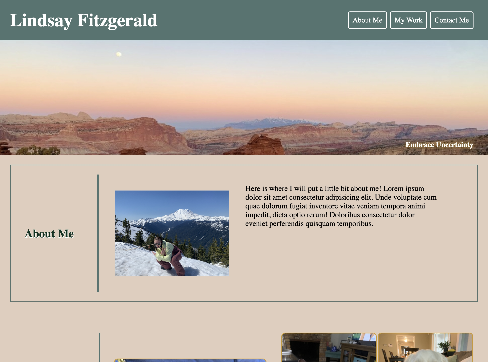
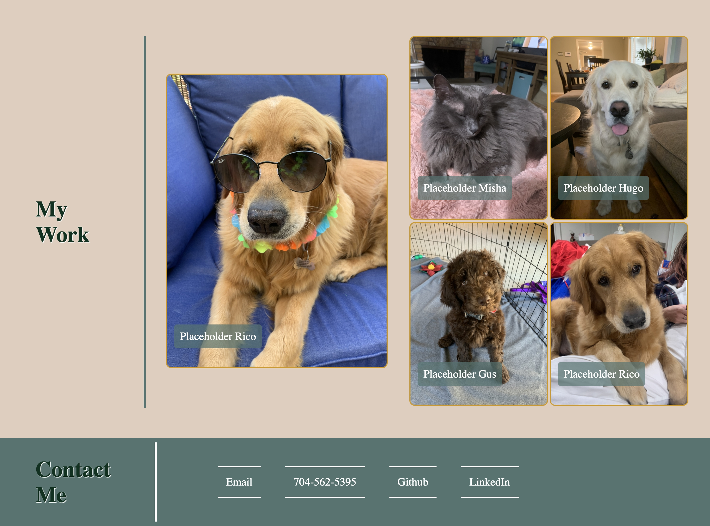
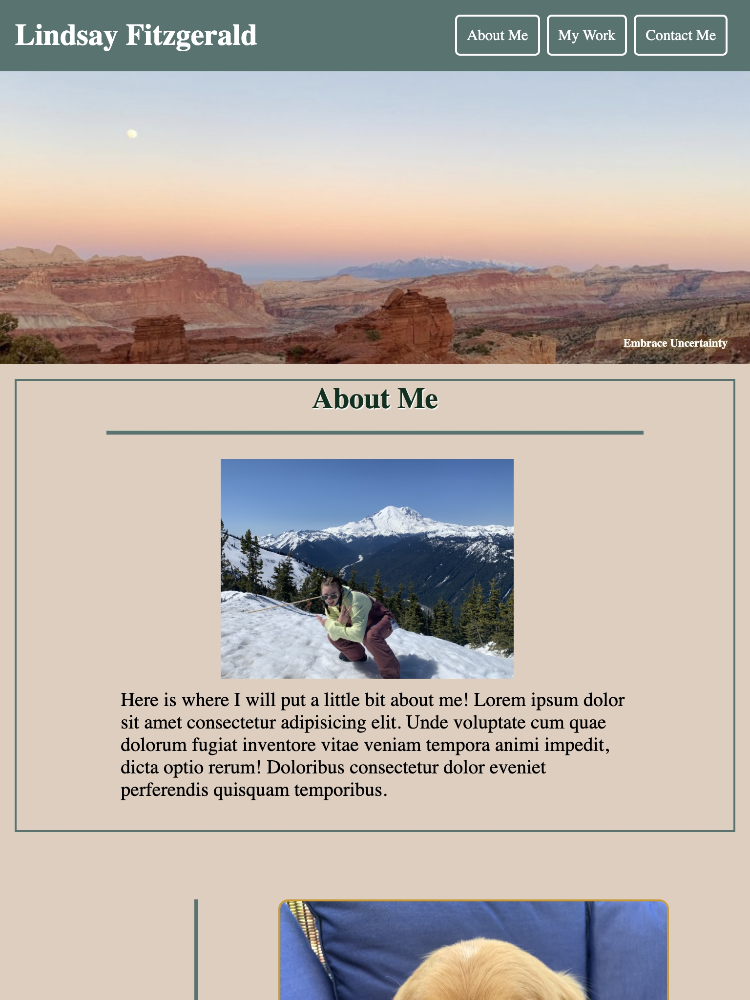
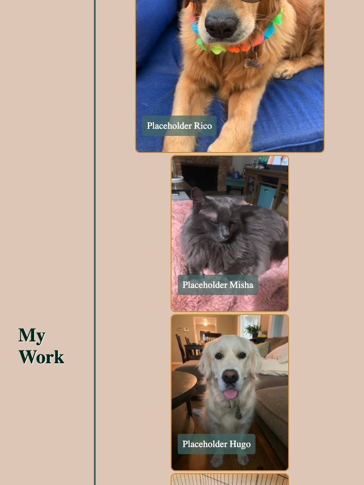
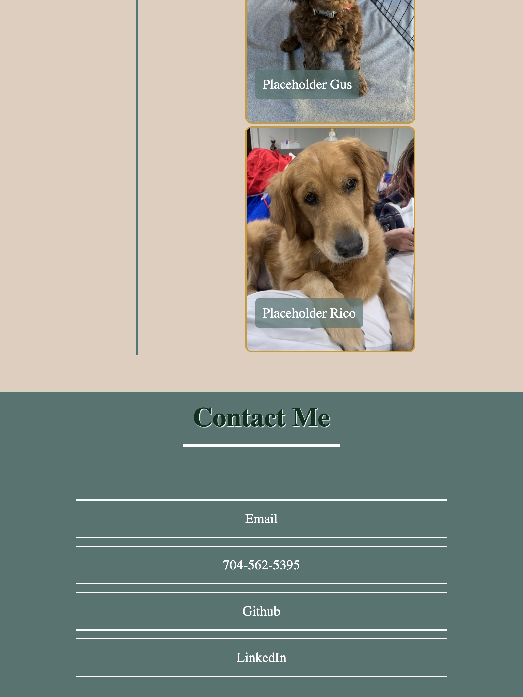
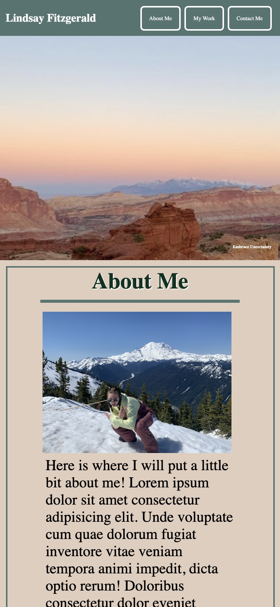
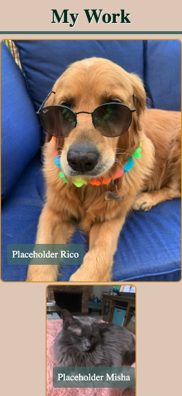
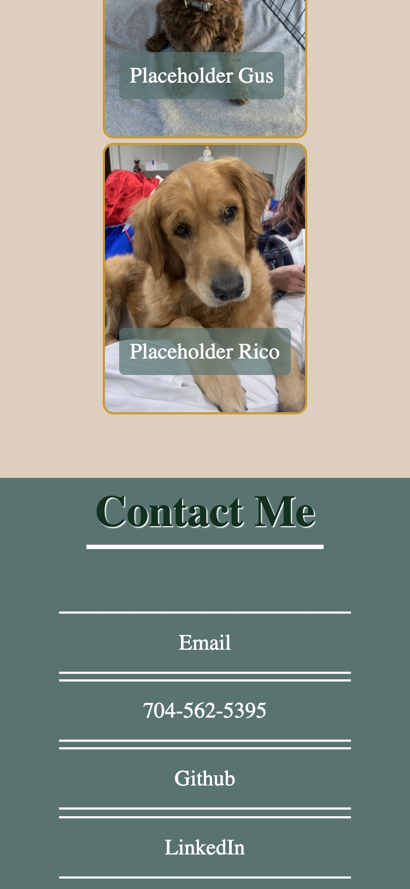

# portfolio
My professional portfolio

This porfolio includes:

- Developers name, a recent photo or avatar, links to sections about them, their work, and how to contact them 
- Those nav links can be clicked and will scroll to the corresponding section
- The link "about work" scrolls to a section with titles images of the developers applications
- The first application in the work section should be larger in size than the others
- Clicking on the images of the applications should bring you to that deployed application
- The layout of the page is responsive and adapts to the viewport so that it may be viewed on various sized screens and devices 

**Application must be:**
- Deployed at a live URL, load without error, repo must contain application code

# Mock-Up
An example of the web applicaitions appearance and functionality: 

## Generic Laptop:

  

## iPad (768px viewport)

  

## iPhone (375px viewport)

# Github Deployed Link

[Link to Deployed Web Application](https://lindsfitz.github.io/portfolio/)